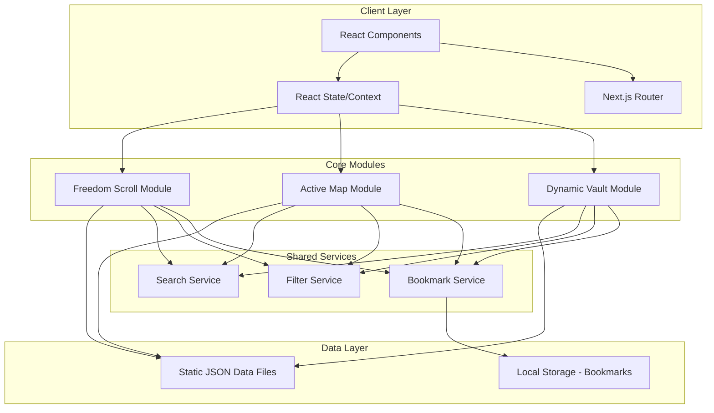
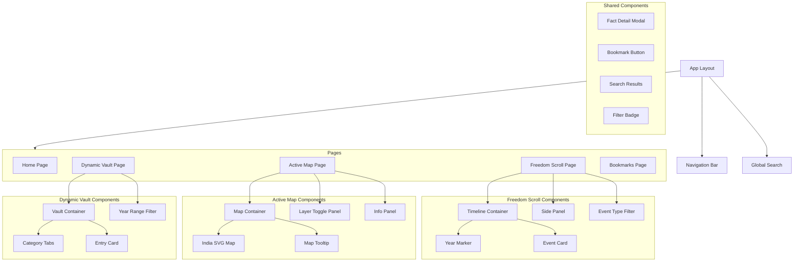
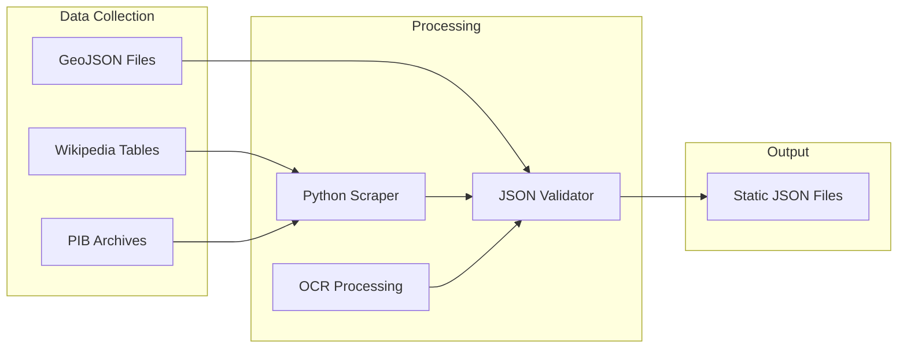

# Design Document: India Facts Portal

## Overview

The India Facts Portal is a React-based single-page application (SPA) built on Next.js that provides an interactive educational platform for UPSC and competitive exam preparation. The portal features three core modules:

1. **Freedom Scroll** - A vertical chronological timeline (1857-1947) with filterable events
2. **Active Map** - An interactive SVG-based India map with toggleable layers
3. **Dynamic Vault** - A categorized current affairs repository (past 5 years)

The application uses client-side rendering with static JSON data files, local storage for bookmarks, and responsive design for cross-device compatibility.

## Architecture



### Technology Stack

- **Framework**: Next.js 14 (App Router)
- **UI Library**: React 18
- **Styling**: Tailwind CSS
- **Map Rendering**: React Simple Maps (SVG-based)
- **Timeline**: Custom React component with CSS animations
- **State Management**: React Context + useReducer
- **Data Storage**: Static JSON files + Local Storage
- **Testing**: Vitest + fast-check (property-based testing)

## Components and Interfaces

### Component Hierarchy



### Core Interfaces

```typescript
// Base Fact Interface
interface Fact {
  id: string;
  title: string;
  content: string;
  category: Category;
  subcategory: string;
  module: Module;
  source: string;
  relatedFacts: string[];
  lastUpdated: string; // ISO date string
}

// Module Types
type Module = 'freedom-scroll' | 'active-map' | 'dynamic-vault';

// Category Types
type Category = 
  | 'History' 
  | 'Geography' 
  | 'Defence' 
  | 'Polity' 
  | 'CurrentAffairs';

// Timeline Event (Freedom Scroll)
interface TimelineEvent extends Fact {
  year: number;
  eventName: string;
  personalities: Personality[];
  impact: string;
  eventType: EventType;
}

type EventType = 'Revolt' | 'CongressSession' | 'GovernorGeneral' | 'Movement' | 'Other';

interface Personality {
  name: string;
  role: string;
  description: string;
}

// Map Element (Active Map)
interface MapElement extends Fact {
  coordinates: Coordinates;
  elementType: MapElementType;
  state: string;
  connections?: string[];
  recentFacts?: string[]; // IDs of related facts from past 5 years
}

type MapElementType = 'River' | 'MountainPass' | 'NationalPark' | 'AirForceBase' | 'NavalBase';

interface Coordinates {
  lat: number;
  lng: number;
}

// Current Affairs Entry (Dynamic Vault)
interface CurrentAffairsEntry extends Fact {
  year: number;
  vaultCategory: VaultCategory;
}

type VaultCategory = 
  | 'DefenceDeals' 
  | 'InternationalSummits' 
  | 'Awards' 
  | 'GovernmentSchemes' 
  | 'EconomicDevelopments';

// Defence Deal specific
interface DefenceDeal extends CurrentAffairsEntry {
  vaultCategory: 'DefenceDeals';
  countriesInvolved: string[];
  equipmentDetails: string;
  strategicSignificance: string;
}

// Summit specific
interface InternationalSummit extends CurrentAffairsEntry {
  vaultCategory: 'InternationalSummits';
  hostCountry: string;
  keyOutcomes: string[];
  indiaRole: string;
}

// Award specific
interface Award extends CurrentAffairsEntry {
  vaultCategory: 'Awards';
  recipient: string;
  achievementDescription: string;
}

// Bookmark
interface Bookmark {
  factId: string;
  module: Module;
  category: Category;
  addedAt: string; // ISO date string
}

// Search Result
interface SearchResult {
  fact: Fact;
  module: Module;
  matchedTerms: string[];
  relevanceScore: number;
}

// Filter State
interface FilterState {
  module: Module;
  categories: Category[];
  subcategories: string[];
  eventTypes?: EventType[];
  yearRange?: { start: number; end: number };
  mapLayers?: MapElementType[];
}
```

### Service Interfaces

```typescript
// Search Service
interface SearchService {
  search(query: string, modules?: Module[]): SearchResult[];
  highlightMatches(text: string, terms: string[]): string;
  getSuggestions(query: string): string[];
}

// Filter Service
interface FilterService {
  applyFilters<T extends Fact>(facts: T[], filters: FilterState): T[];
  getFilterCount(facts: Fact[], filters: FilterState): number;
  clearFilters(module: Module): FilterState;
}

// Bookmark Service
interface BookmarkService {
  addBookmark(factId: string, module: Module, category: Category): void;
  removeBookmark(factId: string): void;
  getBookmarks(): Bookmark[];
  getBookmarksByModule(module: Module): Bookmark[];
  isBookmarked(factId: string): boolean;
}

// Data Service
interface DataService {
  getTimelineEvents(): TimelineEvent[];
  getMapElements(): MapElement[];
  getCurrentAffairs(): CurrentAffairsEntry[];
  getFactById(id: string): Fact | null;
  getRelatedFacts(factId: string): Fact[];
}
```

## Data Models

### JSON Data Structure

#### Timeline Events (freedom-scroll-data.json)
```json
{
  "events": [
    {
      "id": "evt-1857-revolt",
      "title": "First War of Independence",
      "content": "The Indian Rebellion of 1857...",
      "category": "History",
      "subcategory": "Revolts",
      "module": "freedom-scroll",
      "source": "NCERT History",
      "relatedFacts": ["evt-1858-act"],
      "lastUpdated": "2024-01-15",
      "year": 1857,
      "eventName": "Sepoy Mutiny",
      "personalities": [
        {
          "name": "Mangal Pandey",
          "role": "Soldier",
          "description": "First martyr of the rebellion"
        }
      ],
      "impact": "Led to the end of East India Company rule",
      "eventType": "Revolt"
    }
  ]
}
```

#### Map Elements (active-map-data.json)
```json
{
  "elements": [
    {
      "id": "map-nathu-la",
      "title": "Nathu La Pass",
      "content": "Mountain pass in the Himalayas...",
      "category": "Geography",
      "subcategory": "Mountain Passes",
      "module": "active-map",
      "source": "Survey of India",
      "relatedFacts": ["map-sikkim"],
      "lastUpdated": "2024-02-10",
      "coordinates": { "lat": 27.3864, "lng": 88.8308 },
      "elementType": "MountainPass",
      "state": "Sikkim",
      "connections": ["India-China Border", "Old Silk Route"]
    }
  ]
}
```

#### Current Affairs (dynamic-vault-data.json)
```json
{
  "entries": [
    {
      "id": "ca-s400-deal",
      "title": "S-400 Triumf Missile System",
      "content": "India's acquisition of S-400...",
      "category": "Defence",
      "subcategory": "Defence Deals",
      "module": "dynamic-vault",
      "source": "Ministry of Defence",
      "relatedFacts": ["ca-rafale"],
      "lastUpdated": "2024-03-01",
      "year": 2021,
      "vaultCategory": "DefenceDeals",
      "countriesInvolved": ["India", "Russia"],
      "equipmentDetails": "5 squadrons of S-400 air defence systems",
      "strategicSignificance": "Enhanced air defence capability against aerial threats"
    }
  ]
}
```

### Local Storage Schema

```typescript
// Bookmarks stored in localStorage under key: 'india-facts-bookmarks'
interface BookmarkStorage {
  version: number;
  bookmarks: Bookmark[];
}

// Filter preferences stored under key: 'india-facts-filters'
interface FilterStorage {
  version: number;
  filters: {
    [module: string]: FilterState;
  };
}
```


## Correctness Properties

*A property is a characteristic or behavior that should hold true across all valid executions of a system-essentially, a formal statement about what the system should do. Properties serve as the bridge between human-readable specifications and machine-verifiable correctness guarantees.*

### Property 1: Timeline Events Chronological Order
*For any* list of timeline events, when displayed in the Freedom Scroll, the events SHALL be sorted in ascending order by year (1857 to 1947).
**Validates: Requirements 1.1**

### Property 2: Timeline Event Display Completeness
*For any* timeline event, the rendered display SHALL contain the year, event name, at least one personality with name and role, and the impact description.
**Validates: Requirements 1.2**

### Property 3: Year Selection Filters Events
*For any* year and list of timeline events, clicking on that year SHALL return exactly the events where event.year equals the selected year.
**Validates: Requirements 1.3**

### Property 4: Event Type Filter Accuracy
*For any* event type filter and list of timeline events, applying the filter SHALL return only events where event.eventType matches the selected type.
**Validates: Requirements 1.4**

### Property 5: Events Grouped By Year
*For any* list of timeline events with multiple events in the same year, the grouping function SHALL produce groups where all events in each group share the same year.
**Validates: Requirements 1.5**

### Property 6: Layer Toggle State Consistency
*For any* map layer, toggling the layer twice SHALL return the layer to its original visibility state (toggle is its own inverse).
**Validates: Requirements 2.2**

### Property 7: Tooltip Contains Required Details
*For any* map element, the generated tooltip content SHALL contain the element's name, state, and connections (if applicable).
**Validates: Requirements 2.3**

### Property 8: Defence Facts Within 5-Year Window
*For any* defence location and current year, the displayed related facts SHALL only include facts where (currentYear - fact.year) <= 5.
**Validates: Requirements 2.4**

### Property 9: Current Affairs Category Grouping
*For any* list of current affairs entries, grouping by vaultCategory SHALL produce groups where all entries in each group share the same vaultCategory.
**Validates: Requirements 3.1**

### Property 10: Defence Deal Display Completeness
*For any* defence deal entry, the rendered display SHALL contain the deal name, countries involved array, equipment details, and strategic significance.
**Validates: Requirements 3.2**

### Property 11: Summit Display Completeness
*For any* international summit entry, the rendered display SHALL contain the summit name, host country, year, key outcomes array, and India's role.
**Validates: Requirements 3.3**

### Property 12: Award Display Completeness
*For any* award entry, the rendered display SHALL contain the award name, recipient, year, and achievement description.
**Validates: Requirements 3.4**

### Property 13: Year Range Filter Accuracy
*For any* year range [start, end] and list of entries, the filter SHALL return only entries where start <= entry.year <= end.
**Validates: Requirements 3.5**

### Property 14: Category Filter With Descending Sort
*For any* category and list of entries, filtering by category SHALL return entries matching that category sorted by year in descending order (most recent first).
**Validates: Requirements 3.6**

### Property 15: Cross-Module Search Returns Matches With Module Info
*For any* search query and facts across all modules, the search SHALL return results where each result contains the matching fact AND its module identifier.
**Validates: Requirements 4.1, 4.2**

### Property 16: Search Term Highlighting
*For any* text and search terms, the highlight function SHALL wrap each occurrence of each term in the text with highlight markers, preserving the original text content.
**Validates: Requirements 4.3**

### Property 17: Fact Display Contains All Required Fields
*For any* fact, the rendered display SHALL contain the title, content, source, category, subcategory, module, and lastUpdated date.
**Validates: Requirements 5.1, 5.2, 5.3**

### Property 18: Related Facts Displayed As Links
*For any* fact with non-empty relatedFacts array, the display SHALL render a link for each related fact ID.
**Validates: Requirements 5.4**

### Property 19: Historical Event Shows Personalities
*For any* timeline event with personalities, the display SHALL show each personality's name and role description.
**Validates: Requirements 5.5**

### Property 20: Bookmark Round-Trip Persistence
*For any* fact, bookmarking it and then retrieving bookmarks SHALL include that fact's ID in the returned bookmarks.
**Validates: Requirements 6.1, 6.4**

### Property 21: Bookmarks Organized By Module And Category
*For any* set of bookmarks, organizing them SHALL produce groups where all bookmarks in each group share the same module and category.
**Validates: Requirements 6.2**

### Property 22: Bookmark Removal
*For any* bookmarked fact, removing the bookmark SHALL result in that fact's ID not appearing in subsequent bookmark retrievals.
**Validates: Requirements 6.3**

### Property 23: Bookmark Filter By Module
*For any* module and set of bookmarks, filtering by module SHALL return only bookmarks where bookmark.module equals the selected module.
**Validates: Requirements 6.5**

### Property 24: Subcategory Filter Returns Matches
*For any* subcategory and list of facts, filtering by subcategory SHALL return only facts where fact.subcategory equals the selected subcategory.
**Validates: Requirements 7.1**

### Property 25: Multiple Filters Use AND Logic
*For any* combination of filters and list of facts, applying multiple filters SHALL return only facts that satisfy ALL filter criteria simultaneously.
**Validates: Requirements 7.2**

### Property 26: Clear Filters Restores All Facts
*For any* filtered view, clearing all filters SHALL return the complete unfiltered list of facts for that module.
**Validates: Requirements 7.3**

### Property 27: Filter Count Matches Results Length
*For any* filter state and list of facts, the displayed count SHALL equal the length of the filtered results array.
**Validates: Requirements 7.4**

### Property 28: Filter State Preserved Per Module
*For any* module with applied filters, navigating away and back to that module SHALL restore the previously applied filter state.
**Validates: Requirements 7.5**

### Property 29: Fact JSON Serialization Round-Trip
*For any* valid fact object, serializing to JSON and deserializing back SHALL produce an object equal to the original fact.
**Validates: Requirements 9.2**

### Property 30: Data Validation Catches Invalid Fields
*For any* fact data missing required fields (id, title, content, category, module), the validation function SHALL return an error indicating the missing fields.
**Validates: Requirements 9.3**

### Property 31: Data Structure Contains Required Fields By Type
*For any* timeline event, it SHALL contain year, eventName, personalities array, and impact. *For any* map element, it SHALL contain coordinates, elementType, state, and connections.
**Validates: Requirements 9.1, 9.4, 9.5**

## Data Sources

### Freedom Scroll (1857-1947 History)
- **GKToday Modern Indian History**: Structured point-wise event listings
- **Wikipedia Timeline of Indian Independence Movement**: Scrapable tables for JSON conversion
- **Spectrum "A Brief History of Modern India"**: Chronological appendix tables (OCR-friendly)

### Geography Data (Active Map)
- **GitHub India-GIS-Data repositories**: Ready-to-use GeoJSON files for state/district boundaries, river paths, national parks
- **Bhuvan (ISRO Open Data Portal)**: Precise geographical features and coordinates
- **Wikipedia Lists**: Mountain passes, rivers, national parks with coordinates

### Current Affairs & Defence (Dynamic Vault)
- **Press Information Bureau (PIB)**: Official source for defence news, missile tests, inductions
- **Testbook Defence Current Affairs**: Monthly structured PDFs (past 5 years)
- **NewsAPI.org / GNews**: Automated headline fetching with keywords (Indian Navy, DRDO, Exercise)

### Data Pipeline Strategy


## Error Handling

### Data Loading Errors
- Display user-friendly error message if JSON data files fail to load
- Provide retry mechanism for failed data fetches
- Show partial content if some modules load successfully

### Search Errors
- Handle empty search gracefully by maintaining current view
- Sanitize search input to prevent injection
- Limit search results to prevent performance issues

### Local Storage Errors
- Gracefully handle localStorage unavailability (private browsing)
- Validate bookmark data on load, discard corrupted entries
- Provide fallback in-memory storage if localStorage fails

### Map Rendering Errors
- Display fallback static image if SVG map fails to render
- Handle missing coordinate data gracefully
- Provide error boundary for map component crashes

### Validation Errors
- Log validation errors for debugging
- Skip invalid entries rather than failing entire load
- Display warning for partially loaded data

## Testing Strategy

### Testing Framework
- **Unit Testing**: Vitest
- **Property-Based Testing**: fast-check
- **Component Testing**: React Testing Library

### Unit Testing Approach
Unit tests will cover:
- Specific examples demonstrating correct behavior
- Edge cases (empty arrays, null values, boundary dates)
- Error conditions and validation failures
- Integration points between services

### Property-Based Testing Approach
Property-based tests will verify universal properties using fast-check:
- Each property test will run a minimum of 100 iterations
- Tests will use smart generators constrained to valid input spaces
- Each property test will be tagged with the format: `**Feature: india-facts-portal, Property {number}: {property_text}**`

Key property test areas:
1. **Filtering Logic**: Verify filters return correct subsets across all input combinations
2. **Sorting Logic**: Verify chronological and reverse-chronological ordering
3. **Grouping Logic**: Verify grouping functions produce correct partitions
4. **Search Logic**: Verify search returns all and only matching results
5. **Serialization**: Verify JSON round-trip preserves data integrity
6. **Bookmark Operations**: Verify add/remove operations maintain consistency

### Test File Organization
```
src/
├── services/
│   ├── __tests__/
│   │   ├── search.test.ts
│   │   ├── search.property.test.ts
│   │   ├── filter.test.ts
│   │   ├── filter.property.test.ts
│   │   ├── bookmark.test.ts
│   │   ├── bookmark.property.test.ts
│   │   └── data.property.test.ts
├── utils/
│   ├── __tests__/
│   │   ├── validation.test.ts
│   │   └── validation.property.test.ts
```

### Generator Strategy for Property Tests
```typescript
// Example generators for fast-check
const factGenerator = fc.record({
  id: fc.uuid(),
  title: fc.string({ minLength: 1, maxLength: 200 }),
  content: fc.string({ minLength: 1 }),
  category: fc.constantFrom('History', 'Geography', 'Defence', 'Polity', 'CurrentAffairs'),
  subcategory: fc.string({ minLength: 1, maxLength: 50 }),
  module: fc.constantFrom('freedom-scroll', 'active-map', 'dynamic-vault'),
  source: fc.string({ minLength: 1 }),
  relatedFacts: fc.array(fc.uuid(), { maxLength: 5 }),
  lastUpdated: fc.date().map(d => d.toISOString().split('T')[0])
});

const timelineEventGenerator = fc.record({
  ...factGenerator,
  year: fc.integer({ min: 1857, max: 1947 }),
  eventName: fc.string({ minLength: 1, maxLength: 100 }),
  personalities: fc.array(personalityGenerator, { minLength: 1, maxLength: 5 }),
  impact: fc.string({ minLength: 1 }),
  eventType: fc.constantFrom('Revolt', 'CongressSession', 'GovernorGeneral', 'Movement', 'Other')
});
```
