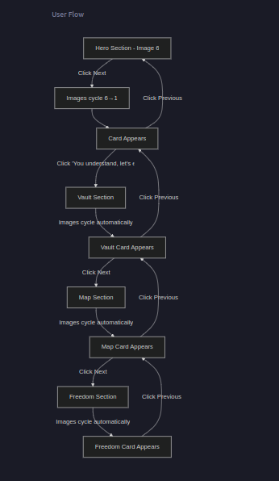

Goal of the app is to give the user information in a very interactive and engaging way.
Like a game.
A user might have a certain knowledge which others don't have.So if the facts being provided and consumed by the user in most efficient way is the goal of the app.

logical architecture -->
a user provide some facts -> the facts are passed to the backend for approval -> once approved the come to the frontend display -> backend engine maps or corelates the facts with the help of tags

technical architecture--:
┌─────────────────────────────────────┐
│ Next.js Frontend (Vercel) │
│ - Displays knowledge base │
│ - Admin UI for adding facts │
└──────────────┬──────────────────────┘
│ API calls (fetch)
▼
┌─────────────────────────────────────┐
│ Node.js Backend (AWS EC2) │
│ - Express/Fastify server │
│ - Endpoints: GET/POST/PUT/DELETE │
│ - Stores: user_knowledge.json │
│ - Merges with hardcoded data │
└──────────────┬──────────────────────┘
│ API calls (fetch)
▼
┌─────────────────────────────────────┐
│ Some middle wire support to │
│ validate the requests │
│ and provide a signal to the │
│ frontend that data is correct │
└──────────────┬──────────────────────┘

